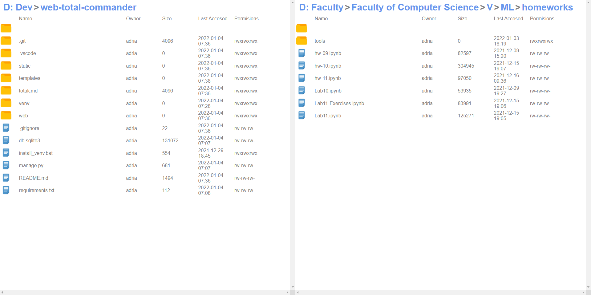

## WEB TOTAL COMMANDER

Web Total Commander is a web app that allow user to acess in broweser the file system and make actions on then



## Installation

Use the package manager [pip](https://pip.pypa.io/en/stable/) to install django.

```bash
pip install django
```

## Usage
```bash
python manage.py runserver
```

# API

The application uses an internal api to facilitate all functionalities. Based on the post request data is sent to an action manager. It calls the specialized functions and returns a standard answer which also envelops the answer after the call. This is a dictionary object, key pairs and values:
- **status**, a number that encodes the stage in which the action came out
- **ok**, the flag that says if the action was successful
- **reason**, a brief description of the status of the action
- **content**, purely useful and returned content by which specific functions

### Action suported
#### **list**
- path_id
#### **open**
- path_id
#### **rename**
- path_id
- value
#### **mkfile**
- path_id
- value
#### **mkdir**
- path_id
- value
#### **remove**
- path_id
#### **move**
- path_id
- target_path_id
#### **copy**
- path_id
- target_path_id

# Security

Each path has an id that identifies it. The id is encrypted to increase data privacy and restrict access context if necessary. Use symmetric encryption with a key unknown to the end user with the fernet algorithm. 


## License
[MIT](https://choosealicense.com/licenses/mit/)